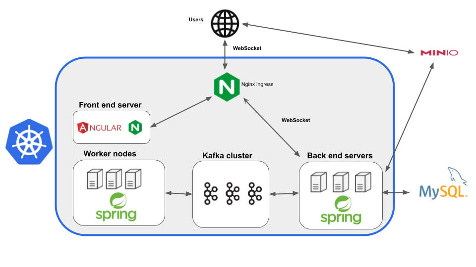

# Description

This is a web application that receives video files from users and extracts audio stream and/or changes its resolution.
Users are notified of the progress via WebSocket connection.
The application executes in a Kubernetes cluster with 4 main components:
1. Front end servers
2. Back end servers
3. Kafka cluster
4. Worker nodes

User data is kept in a MySQL database outside Kubernetes cluster.  

Users send a request to a back end server, proxied via Nginx ingress, to obtain presigned URLs to upload their videos to S3 compatible object storage. After finishing the upload, they notify a back end server. Back end server then sends a message to a Kafka topic.  

Worker nodes retrieve messages and process them. They send notifications to another Kafka topic. These messages are processed by back end servers so they can notify users via WebSocket connection.
After processing is finished, the user gets presigned URLs to download processed files.

